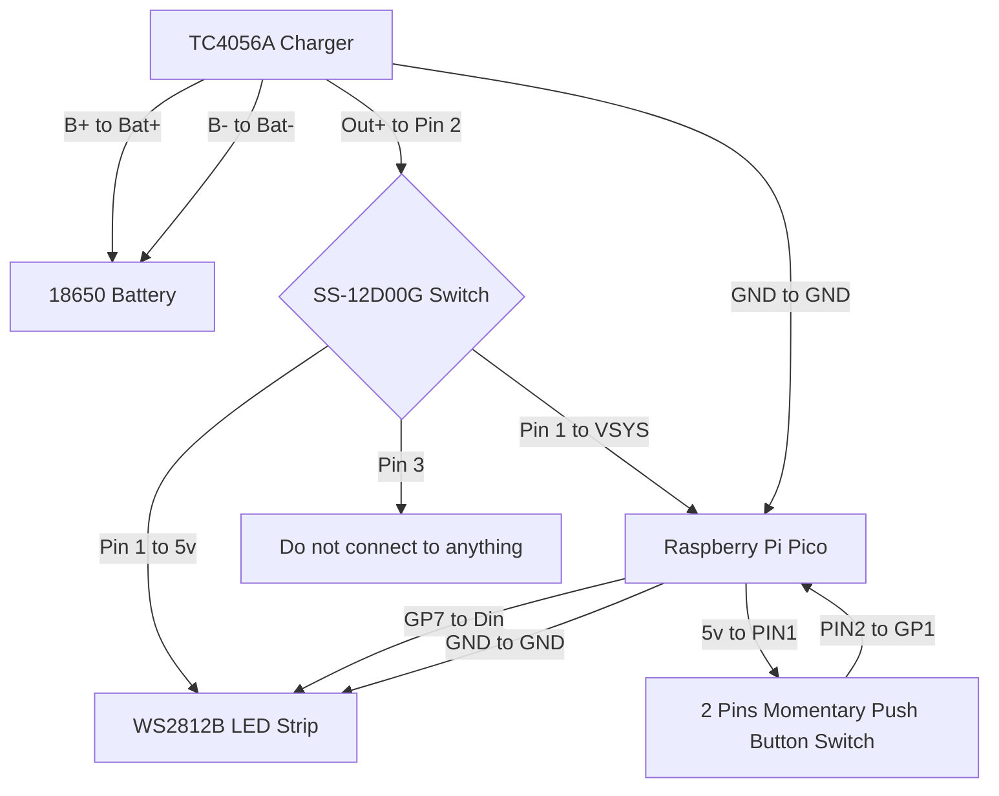
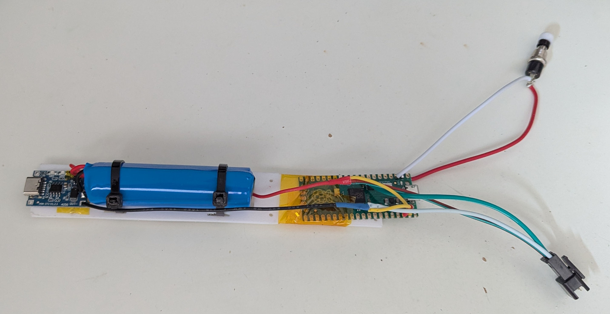
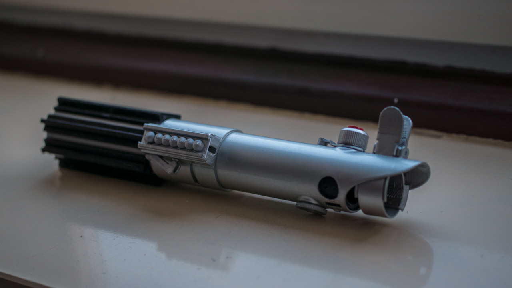
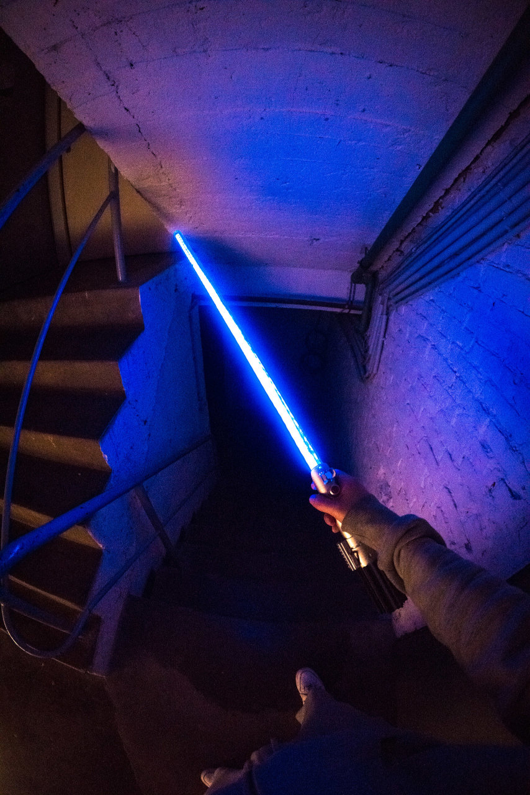

# CheapSaber
Building a lightsaber for under 25€ (electronics only) from cheap Chinese parts. It does have a draw animation and can shift between multiple color presets.
For the shell of the saber, there are a multitde of different methods to build one. I chose [this](https://www.punishedprops.com/2019/12/16/ros-lightsaber/) model by Bill Doran from punishedprops, licensed under Creative Commons (4.0 International License). I also included it in the repository, for archival purposes. The BOM only includes electronic parts, not the parts for whatever outer shell you choose to build. 

## BOM
Note: Some of these parts are best purchased in bulk. 

| Part Name  |  Unit Price | Bulk Order Price
| ------------- |  ------------- | ------------- | 
| WS2812B DC5V LED Strip, 2m, 60 LEDs | 6.50€ | 6.5€ (1)
| 2 Pins Momentary Push Button Switch | 0.30€ | 3€ (10)
| TC4056A LiPo/LiIon charging module | 0.25€ | 2.50€ (10)
| SS-12D00G 4mm slide switch | 0.10€ | 2.10€ (20)
| Various cables | 1.00€ | 1.00€
| Raspberry Pi Pico  |  2.60€  | 2.60 (1)
| 18650 Battery  |  7.00€  | 7.00€ (1)
| **Total** | **17.75€** | **24.20€** 

In addition to the parts listed here, you need to construct a lightsaber shell, which I did from mostly 3D printed parts. The total cost for the used PLA and spraycolor was below 5€. 
The polycarbonate tube and diffuser can be quite pricy, depending on where you live but it is unlikely that you are going to spend more than 70€ in total. I purchased a tube locally for 20€, as well as greaseproof paper as a diffuser for 2€. 

## Wiring

## Build tutorial

1. 3D-print all parts or construct the outer shell as you see fit. 
2. Solder the 18650 to the TC4056A Charger, B+ to the battery's positive, Bat- to the negative.
3. Solder a long wire to the ground load pad of the TC4056A. The wire needs to be split into two, for example, by twisting wires. One end terminates in a ground pad of the Pi Pico, the other one goes to the connector that comes with your LED strip (ground pin).  
4. Solder a short wire from the 5V load pad of the TC4056A to the first pin of the SS-12D00G 4mm slide switch. 
5. Solder a long wire to the second pin. The wire needs to be split into two again, one end terminates in the VSYS pad of the Pi Pico, the other one goes to the connector that comes with your LED strip (5v pin).   
6. For good measure, remove or isolate the last pin of the switch so that it doesn't accidentally connect to anything in the off position. At this point you can test whether or not the Pi Pico powers on. 
7. Now you can solder the 2 pins momentary push button switch to the Pi Pico, one pin to GP1 and the other to a 5V pad on the Pi Pico.
8. At this point you can install Circuitpython, the neopixel library, as well as the code.py script to your Pi Pico.
9. Fasten all the parts on whatever mount you use to hold everything together inside the shell. 
10. Glue the WS2812B LED strip on a small piece of cardboard (fold it at the top between two LEDs so you get an even number on both sides) and put it in your polycarbonate tube. 
You can now connect the S2812B LED strip to the connector that you soldered to your Pi Pico and test if everything works.

## Pictures

